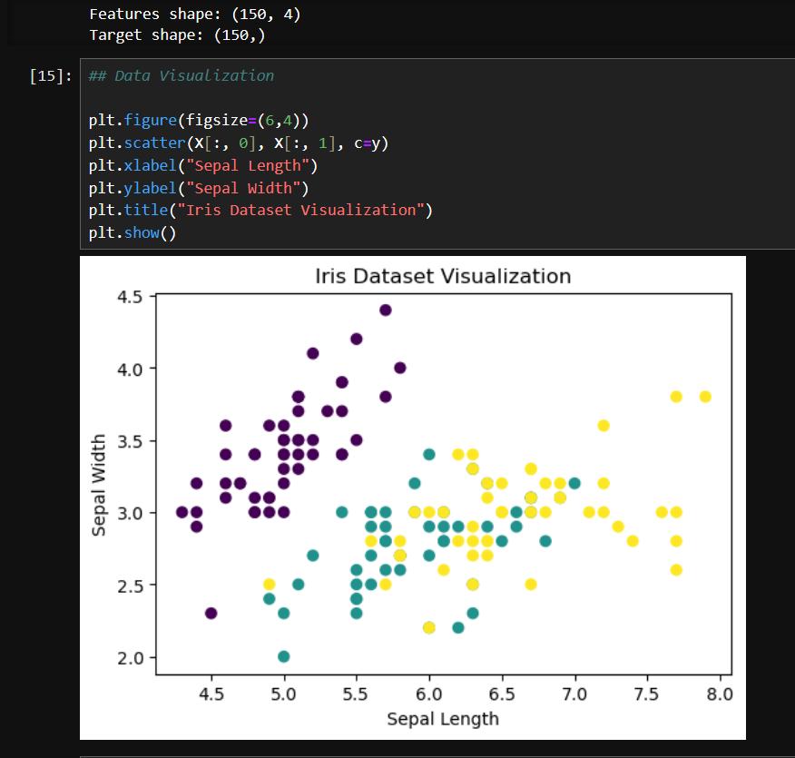
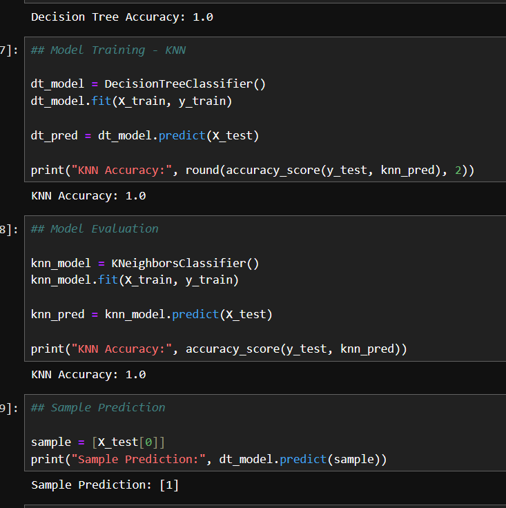

# Iris Classification using Machine Learning

## Project Overview
This project demonstrates a basic machine learning workflow using the Iris dataset.

## Technologies Used
- Python
- NumPy, Pandas
- Matplotlib
- Scikit-learn

## Models Used
- Decision Tree
- K-Nearest Neighbors (KNN)

## Results
- Compared model performance using accuracy
- Visualized dataset using scatter plots

## Output
### Visualization

### Model Accuracy & Prediction

## How to Run
1. Install dependencies:
   pip install -r requirements.txt

2. Run Jupyter Notebook:
   jupyter notebook

## Learning Outcome
- Understanding ML workflow
- Model training and evaluation
